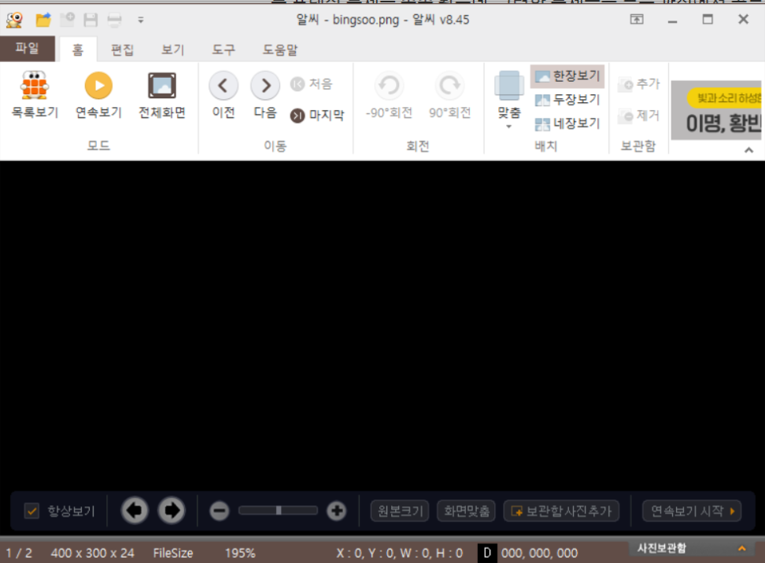
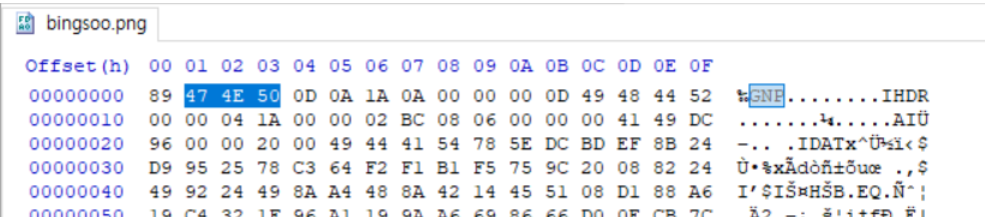
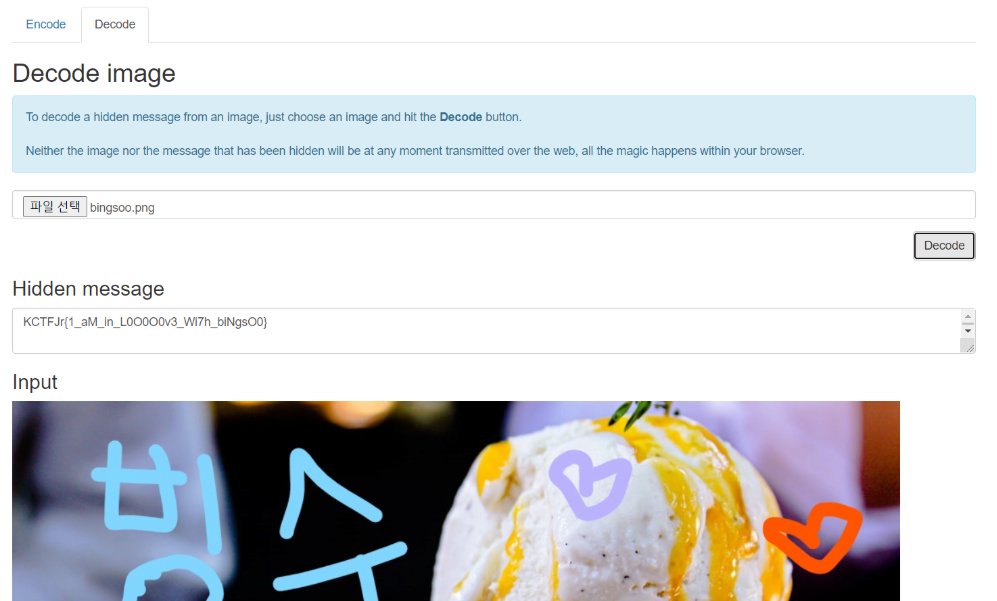

##BINGSOO

문제 : bingsoo.zip
출제의도 : steganography에 대해서 아는가?

zip파일을 열면 png파일이 있으나, 내용이 변조되어 확인할 수 없다.

HxD로 파일을 열어보면, 맨 처음 파일 종류가 PNG가 아니라 GNP로 되어있는 것을 볼 수 있다. 

이걸 PNG로 수정하면 다음과 같은 png파일을 얻을 수 있다.

이후 그냥 인터넷 스테가노그래피로 디코딩하였다.

***FLAG : KCTFJr{1_aM_in_L0O0O0v3_Wi7h_biNgsO0}***

